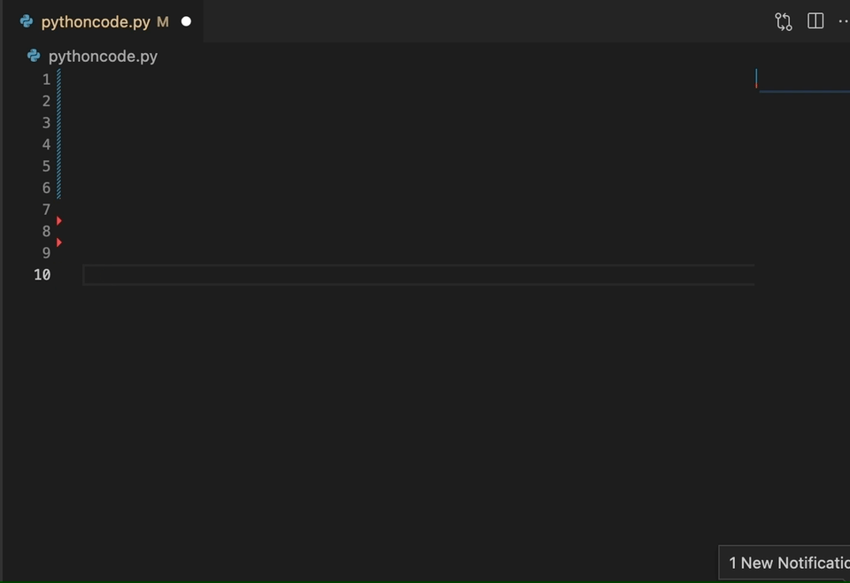
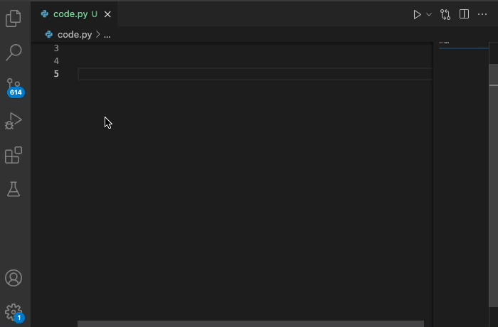
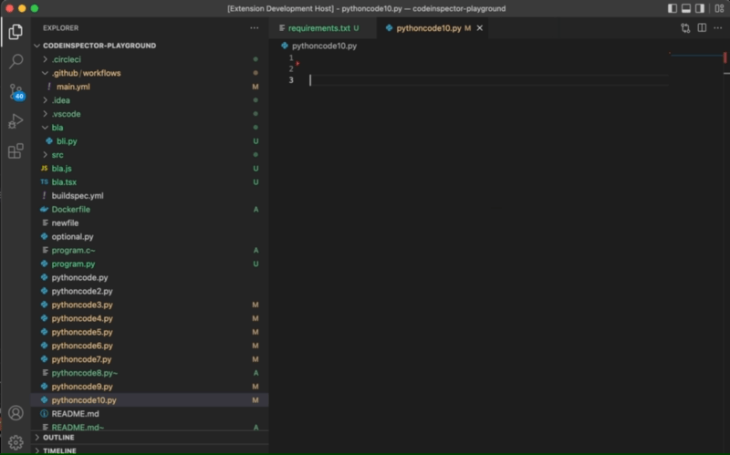
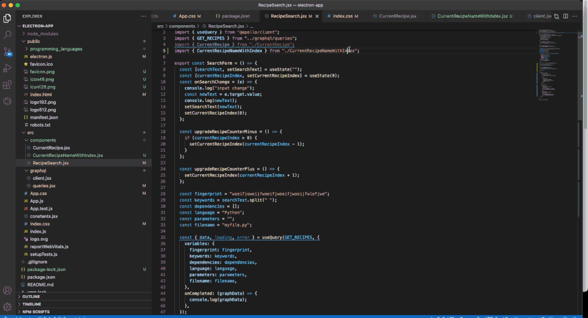
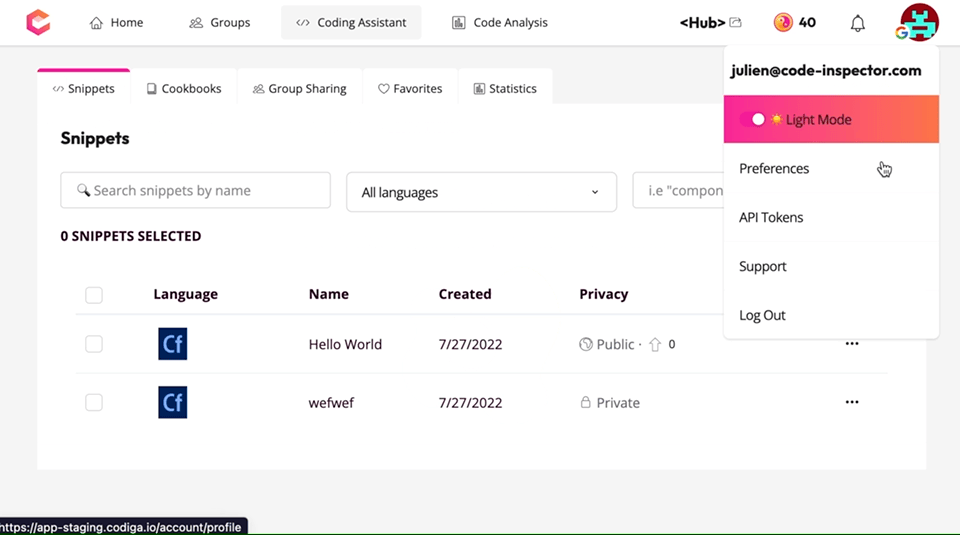

[Codiga](https://www.codiga.io) is a [Smart Code Snippets](https://www.codiga.io/code-snippets/smart-code-snippets/) manager. Create, share, search and use Smart Code Snippets from your IDE.

# Codiga: Code Snippets on Steroids

Look for snippets using a shortcut or search using inline completions like GitHub Copilot.

Adapt the list of snippets by adding your own.

## Quick Start

Start a comment and type what you want to have. Like GitHub Copilot, it suggests a list of snippets you can insert in your code.

## Use Snippets using Shortcuts

Install the extension and type `.` or `/` in your IDE to list all available smart code snippets for your project. Accept a smart code snippet using either Enter ↩ or Tab ↹. Go through the snippet variables using the Tab key.

**Note**: snippets are suggested based on your environment: language, libraries used, and filename (e.g. especially for YML files).

## Find and Reuse Smart Code Snippets

- Get all snippets with a shortcut by using `CTRL` + `ALT` + `S` (`CMD` + `SHIFT` + `S` - `⌘⇧S` on Mac) and reuse them inline
- Find snippets using an internal search engine using `CTRL` + `ALT` + `C` (`CMD` + `SHIFT` + `C` - `⌘⇧C` on Mac) and search for a snippet
- Import a snippet by typing its shortcut (e.g. `react.component` in JavaScript/Typescript or `requests.` in Python)

## Create Smart Code Snippets

Create a smart code snippet by selecting the code and click on `Create Codiga Snippet`. The keywords put in your snippet are used to index the snippet and find it using smart search.

## Supported Languages

C, C++, CSS, HTML, Java, Javascript, Typescript, Python, Dart, Ruby, PHP, Scala, Apex, Terraform, Docker, Go, Rust, Shell, Solidity, YAML.

## Getting API keys from Codiga

You need an API Token from [Codiga](https://codiga.io).
Log on [Codiga](https://app.codiga.io) using your GitHub, GitLab or Bitbucket account.

Then, in your preferences, generate a new API key as shown below.

Add the token in your VS Code preferences.

## Sending feedback

You can either fill a [bug report](https://github.com/codiga/vscode-plugin/issues) directly.
If you do not want to open a ticket, you can also directly [contact us](https://codiga.io/contact).

## Learn More

- [Official Documentation](https://doc.codiga.io/docs/coding-assistant/coding-assistant-vscode/)
- [List of all supported languages](https://doc.codiga.io/docs/faq/#what-languages-are-supported)
- [Privacy Policy](https://www.codiga.io/privacy)
