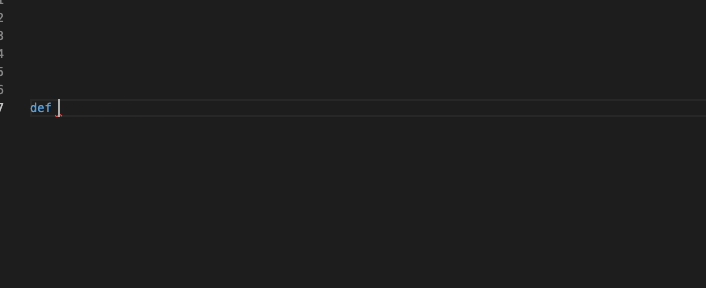
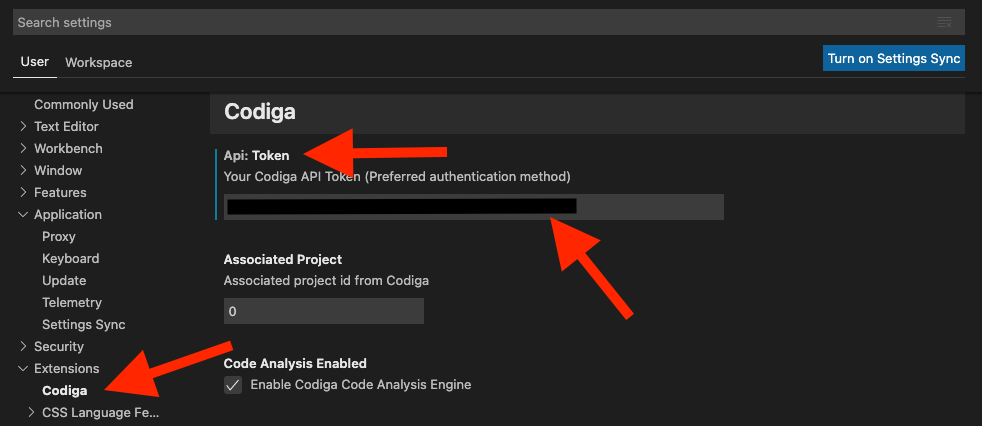

[](https://join.slack.com/t/codigahq/shared_invite/zt-9hvmfwie-9BUVFwZDwvpIGlkHv2mzYQ)
[](https://twitter.com/getcodiga)
[](https://marketplace.visualstudio.com/items?itemName=codiga.vscode-plugin)
[](https://marketplace.visualstudio.com/items?itemName=codiga.vscode-plugin)
[](https://app.codiga.io/public/project/29693/vscode-plugin/dashboard)
[](https://app.codiga.io/public/project/29693/vscode-plugin/dashboard)

# Codiga: Static Code Analysis on Steroids 🚀

- Works for Python, JavaScript and TypeScript (C# and Java coming)
- Fix security vulnerabilities and coding mistakes from your IDE
- Let you write your own custom rules ([tutorial](https://app.codiga.io/hub/tutorial) or [documentation](https://doc.codiga.io/docs/rosie/rosie-introduction/))



## Getting Started 🏃‍♀️

### Automatic 🙌

Run the following command at the _root_ of your project.

```bash
npx @codiga/cli@latest ruleset-add
```

It will create a `codiga.yml` file at the root of your project, which is used to know what rulesets to use. You can refine the rulesets later and rulesets you find on the [Codiga Hub](https://app.codiga.io/hub/rulesets).

### Manually 🐌

1. Add your API key (see below)
2. Visit the [Codiga Hub](https://app.codiga.io/hub/rulesets) and select the rulesets to use for your project.
3. Create a `codiga.yml` at the root of your project with the list of rulesets you want to use. An example of a `codiga.yml` file for Python is shown below.

```yaml
rulesets:
  - python-security
  - python-best-practices
```

## API keys

To use Codiga, you need an API Token from [Codiga](https://codiga.io).
Log on [Codiga](https://app.codiga.io) using your GitHub, GitLab, Bitbucket or Google account.

Then, in your preferences, generate a new API key as shown below.


Add the token in your VS Code preferences.



## Sending feedback

You can either fill a [bug report](https://github.com/codiga/vscode-plugin/issues) directly.
If you do not want to open a ticket, you can also directly [contact us](https://codiga.io/contact).

## Learn More

- [Official Documentation](https://doc.codiga.io/docs/coding-assistant/coding-assistant-vscode/)
- [List of all supported languages](https://doc.codiga.io/docs/faq/#what-languages-are-supported)
- [Privacy Policy](https://www.codiga.io/privacy)
